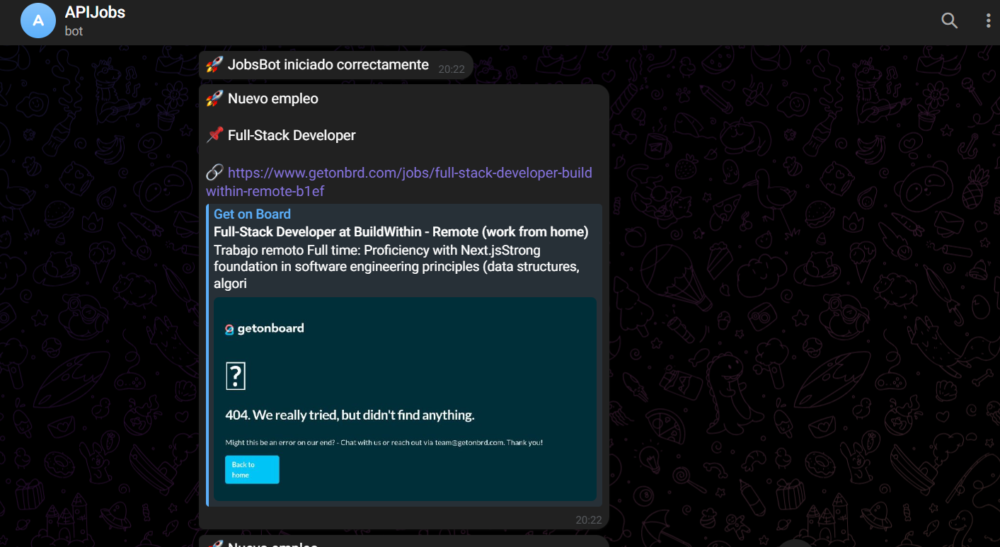
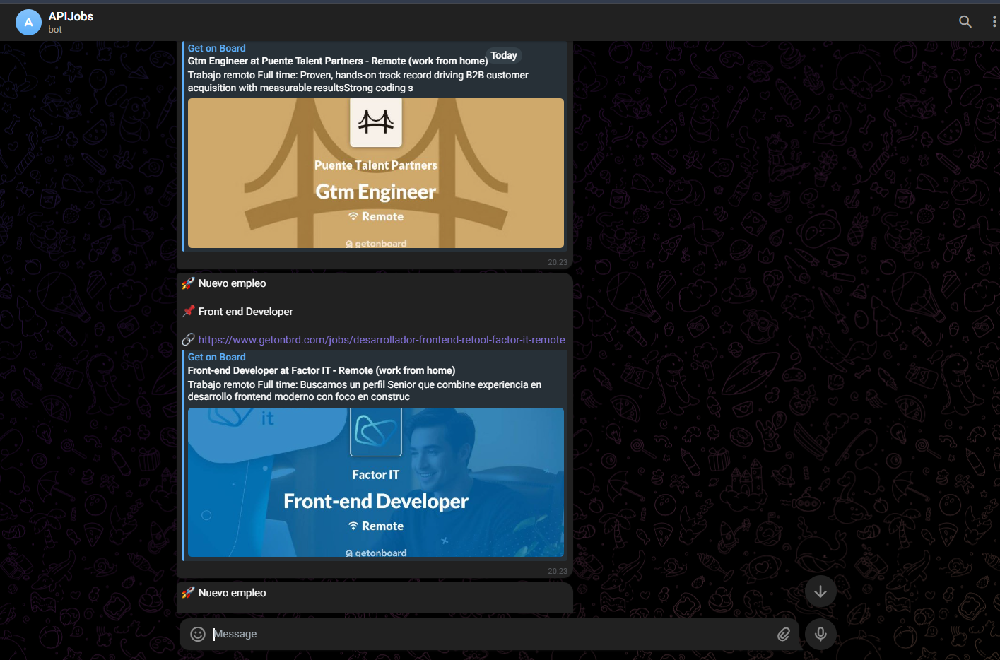
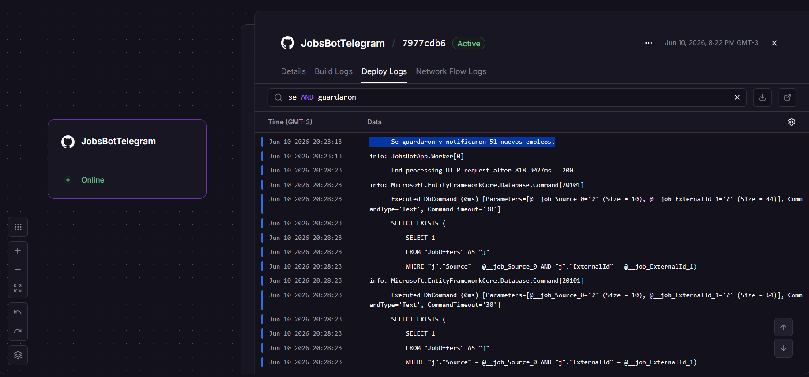

# 🚀 JobsBotTelegram

Aplicación desarrollada con **.NET 8 Worker Service** que consulta periódicamente la API de **GetOnBoard**, filtra ofertas relacionadas con tecnologías como **.NET**, **C#**, **Backend**, **React** y **Full Stack**, almacena únicamente nuevas publicaciones en **SQLite** y envía notificaciones automáticas mediante un **Bot de Telegram**.

## 📋 Descripción

El objetivo del proyecto es automatizar la búsqueda de oportunidades laborales, evitando revisar manualmente los portales de empleo y notificando únicamente las nuevas ofertas que cumplen con determinados criterios.

## ✨ Funcionalidades

* Consulta automática de la API de GetOnBoard.
* Filtrado de ofertas por palabras clave.
* Mapeo de la respuesta de la API a modelos propios (DTO → Entidad).
* Persistencia de datos utilizando Entity Framework Core y SQLite.
* Control de duplicados mediante índice único (`Source + ExternalId`).
* Envío de notificaciones en tiempo real mediante Telegram.
* Ejecución continua como Background Worker.
* Contenerización con Docker para facilitar el despliegue.

## 📱 funcionamiento





## 🏗️ Arquitectura

```text
                    GetOnBoard API
                           │
                           ▼
                  GetOnBoardProvider
                           │
                           ▼
                  Filtrado por Keywords
                           │
                           ▼
                    Entity Framework
                           │
                           ▼
                         SQLite
                           │
                           ▼
                  TelegramService
                           │
                           ▼
                     Bot de Telegram
```

## 🛠️ Tecnologías utilizadas

* .NET 8
* C#
* Worker Service
* Entity Framework Core
* SQLite
* HttpClient
* Telegram.Bot
* Docker
* Git / GitHub

## 📁 Estructura del proyecto

```
JobsBotApp
│
├── Data
│   ├── JobsDbContext
│   └── JobsDbContextFactory
│
├── DTOs
│   ├── GetOnBoardResponseDto
│   ├── GetOnBoardJobDto
│   ├── GetOnBoardAttributesDto
│   └── GetOnBoardLinksDto
│
├── Features
│   ├── GetOnBoard
│   │   ├── JobOffer
│   │   └── Services
│   │       ├── IJobProvider
│   │       └── GetOnBoardProviderImpl
│   │
│   └── Telegram
│       ├── ITelegramService
│       └── TelegramServiceImpl
│
├── Worker.cs
└── Program.cs
```

## ⚙️ Funcionamiento

Cada 5 minutos el Worker realiza el siguiente proceso:

1. Consulta la API pública de GetOnBoard.
2. Obtiene las ofertas laborales disponibles.
3. Filtra las publicaciones por palabras clave.
4. Verifica si la oferta ya fue almacenada.
5. Guarda únicamente las nuevas ofertas.
6. Envía una notificación mediante Telegram.

## 🐳 Ejecución con Docker

Construir la imagen:

```bash
docker build -t jobsbottelegram .
```

Ejecutar el contenedor:

```bash
docker run jobsbottelegram
```

## 🔐 Variables de entorno

```
Telegram__BotToken=YOUR_BOT_TOKEN
Telegram__ChatId=YOUR_CHAT_ID
```

## 💻 Ejecución local

```bash
dotnet restore
dotnet build
dotnet run
```

## 🎯 Conceptos aplicados

* Programación asíncrona con `async/await`
* Background Services
* Inyección de dependencias
* Consumo de APIs REST
* DTO Mapping
* Entity Framework Core
* Persistencia con SQLite
* Control de duplicados mediante índices únicos
* Integración con APIs externas
* Dockerización de aplicaciones .NET

---

## 👨‍💻 Autor

**Roberto Torre**


📧 Email torreroberto1996@gmail.com

💻 GitHub https://github.com/RobertoTorre96
